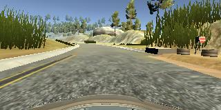
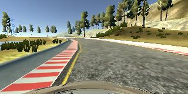
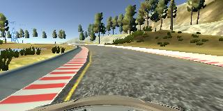
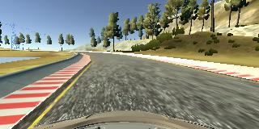

# **Behavioral Cloning** 

## Writeup Template

### You can use this file as a template for your writeup if you want to submit it as a markdown file, but feel free to use some other method and submit a pdf if you prefer.

---

**Behavioral Cloning Project**

The goals / steps of this project are the following:
* Use the simulator to collect data of good driving behavior
* Build, a convolution neural network in Keras that predicts steering angles from images
* Train and validate the model with a training and validation set
* Test that the model successfully drives around track one without leaving the road
* Summarize the results with a written report


[//]: # (Image References)

[image1]: ./examples/placeholder.png "Model Visualization"
[image2]: ./examples/placeholder.png "Grayscaling"
[image3]: ./examples/placeholder_small.png "Recovery Image"
[image4]: ./examples/placeholder_small.png "Recovery Image"
[image5]: ./examples/placeholder_small.png "Recovery Image"
[image6]: ./examples/placeholder_small.png "Normal Image"
[image7]: ./examples/placeholder_small.png "Flipped Image"

## Rubric Points
### Here I will consider the [rubric points](https://review.udacity.com/#!/rubrics/432/view) individually and describe how I addressed each point in my implementation.  

---
### Files Submitted & Code Quality

#### 1. Submission includes all required files and can be used to run the simulator in autonomous mode

My project includes the following files:
* model.py containing the script to create and train the model
* model.ipynb containing the visuals of the training data 
* drive.py for driving the car in autonomous mode
* model.h5 containing a trained convolution neural network 
* writeup_report.md or writeup_report.pdf summarizing the results

#### 2. Submission includes functional code
Using the Udacity provided simulator and my drive.py file, the car can be driven autonomously around the track by executing 
```sh
python drive.py model.h5
```

#### 3. Submission code is usable and readable

The model.py file contains the code for training and saving the convolution neural network. The file shows the pipeline I used for training and validating the model, and it contains comments to explain how the code works.

### Model Architecture and Training Strategy

#### 1. An appropriate model architecture has been employed

My model consists of a convolution neural network with 3x3 filter sizes and depths between 32 and 128 (model.py lines 18-24) 

The model includes RELU layers to introduce nonlinearity (code line 20), and the data is normalized in the model using a Keras lambda layer (code line 18). 

#### 2. Attempts to reduce overfitting in the model

The model contains dropout layers in order to reduce overfitting (model.py lines 21). 

The model was trained and validated on different data sets to ensure that the model was not overfitting (code line 10-16). The model was tested by running it through the simulator and ensuring that the vehicle could stay on the track.

#### 3. Model parameter tuning

The model used an adam optimizer, so the learning rate was not tuned manually (model.py line 25).

#### 4. Appropriate training data

Training data was chosen to keep the vehicle driving on the road. I used a combination of center lane driving, recovering from the left and right sides of the road ... 

For details about how I created the training data, see the next section. 

### Model Architecture and Training Strategy

#### 1. Solution Design Approach

The overall strategy for deriving a model architecture was to drive the car in the simulator with low loss value while avoiding overfitting.

My first step was to use a convolution neural network model similar to the LeNet I gave this model a go to see how this model is doing. But the model was not able to make steer around the curve. I then used Nvidia's model as suggested in Udacity classroom. This model performed good on the Udacity training data. I then generated more data(details in next section).

In order to gauge how well the model was working, I split my image and steering angle data into a training and validation set. Although the validation loss and training loss were less the car was not able to drive properly at curves while on the other parts car was steering too much. As I am using many images it seemed that model might be overfitting. 

To combat the overfitting, I included the 3 dropout layers.

The final step was to run the simulator to see how well the car was driving around track one. There were a few spots where the vehicle fell off the track like the turns after the bridge, to improve the driving behavior in these cases, I generated recovery data and included that in training.

At the end of the process, the vehicle is able to drive autonomously around the track without leaving the road.
After this I tried with the track two and model was not able to drive at all. Then I generated data for the track two and trained to that data leading car to drive a bit better on track two.

#### 2. Final Model Architecture

The final model architecture (model.py lines ) consisted of a convolution neural network with the following layers and layer sizes:


#### 3. Creation of the Training Set & Training Process

To capture good driving behavior, I first recorded two laps on Track one using center lane driving. Here is an example image of center lane driving:



I then recorded the vehicle recovering from the left side and right sides of the road back to center after bridge so that the vehicle would learn to turn around from the dirt after bridge. These images show what a recovery looks like starting from ... :





Then I repeated this process on track two in order to get more data points.

Then after loading the data I removed 75% of zero data as 0 data will introduce more data while flipping and taking left and right images for the same image.
``` sh
result_indices_zero = np.random.choice(zero_indices[0], int(len(zero_indices[0])/4))
```

To augment the data sat, I also flipped images and angles thinking that this would double the data and it will kind of generate data like driving in anti-clockwise direction. For example, here is an image that has then been flipped:

![alt text][images/center_2018_02_23_14_19_52_063.jpg]
![alt text][images/center_2018_02_23_14_19_52_063_flipped.jpg]

After the collection process, I had 132352 number of data points. Image loading and image flipping is done inside the generator. I then preprocessed this data by dividing the data by 127.5 and then substracting it from 1. After that I crop the image by 58 pixel from the top and 24 pixel from the bottom to remove the sky and the car hood from image.

I finally randomly shuffled the data set and put 20% of the data into a validation set. Shuffling is done on complete dataset as well as on the output of the generator, as in generator we are flipping images, shuffling was needed.

To Run the car on track two I generated data on the track two and then trained the model for this track also.

![alt text][images/center_2018_02_25_17_35_09_048.jpg]

I used this training data for training the model. The validation set helped determine if the model was over or under fitting. The ideal number of epochs was 3 as after that loss was not decreading significantly. I used an adam optimizer so that manually training the learning rate wasn't necessary.
